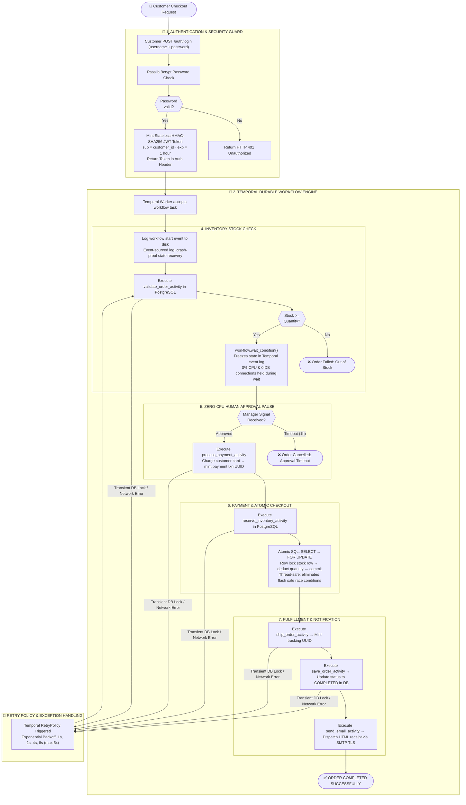

# Project 1: Distributed Order Processing Engine

---

### 🎯 Quick Pitch (How to Explain in 30 Seconds)
> *"This project is an enterprise distributed checkout engine built with **FastAPI**, **Temporal.io**, **PostgreSQL**, and **JWT**. When a user places an order, FastAPI accepts it in **15 milliseconds** and returns an instant response. In the background, Temporal workers run a crash-proof 7-step workflow that handles inventory validation, zero-CPU manager approval pauses, atomic SQL stock deductions, and email receipts."*

---

### 🔀 Step-by-Step System Logic & Execution Flow

---

### 💡 4 Key Takeaways to Highlight to the Audience
1. **15ms Response Speed**: Customers receive instant checkout confirmation while heavy background processing runs in Temporal queues.
2. **Crash-Proof Durability**: Temporal records every event to disk, resuming execution automatically if server pods restart mid-checkout.
3. **Zero-CPU Execution Pauses**: Pauses high-value orders for manager approval without consuming CPU memory or DB connections.
4. **Atomic Stock Locking**: SQL `SELECT ... FOR UPDATE` row locks eliminate stock overselling during flash sales.
